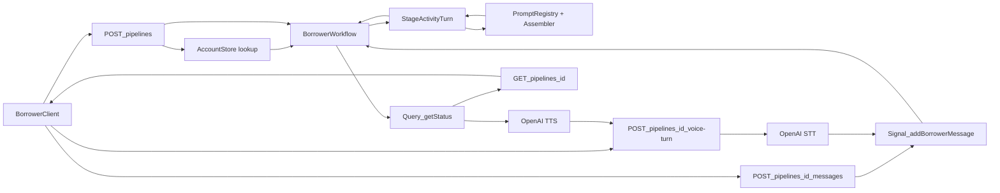
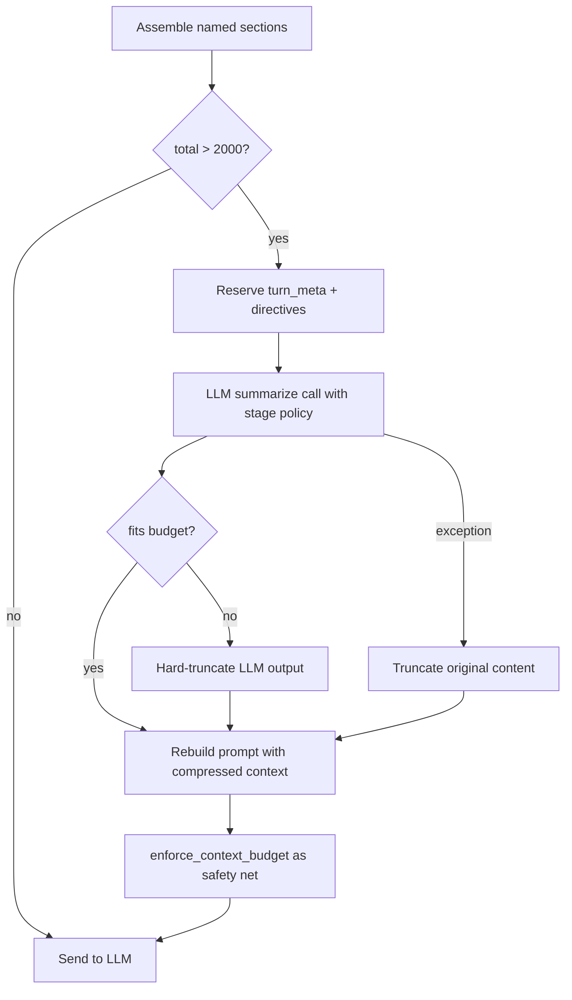
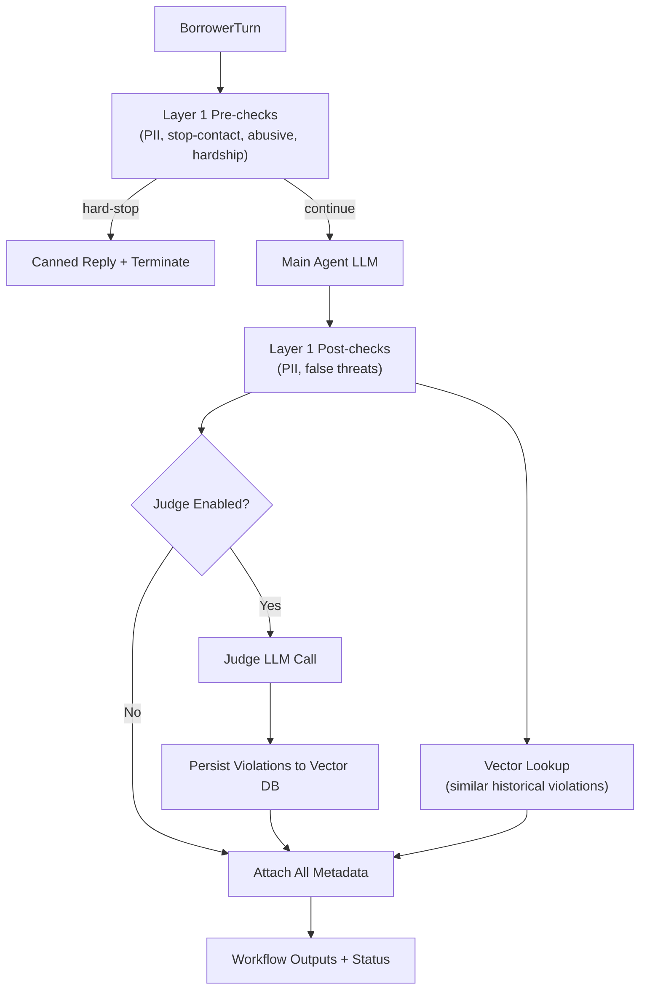
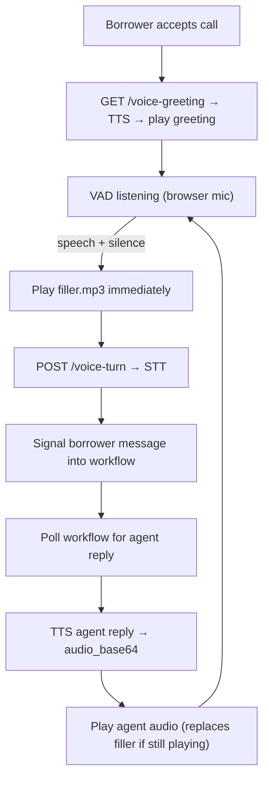

# Architecture

Current architecture for the multi-turn debt-collection pipeline.

## System Overview

The system is a Temporal-orchestrated, stage-based conversational workflow:

- Stage 1: `assessment` (chat)
- Stage 2: `resolution` (voice call when `AGENT2_VOICE_ENABLED=true`, otherwise chat)
- Stage 3: `final_notice` (chat)

The borrower conversation is multi-turn at each stage. The workflow advances only when the current stage reports `stage_complete=true`. Assessment and final-notice are **agent-initiated** — the agent speaks first via a `STAGE_OPENER_SENTINEL` marker; resolution is **borrower-initiated**.

Hard constraints enforced in code:

- **2000 total tokens** per agent context window (system prompt + user prompt).
- **500 max tokens** for handoff summary passed between stages.
- **2000 max tokens** for any single borrower message (oversized messages get a canned reply).
- Agent 1 starts fresh (no handoff). Agent 2 receives assessment context. Agent 3 receives merged assessment + resolution context.

## Runtime Components

- **API service**: [app/main.py](app/main.py)
  - Starts workflows, signals borrower messages into running workflows, queries status
  - Looks up borrower records from the `AccountStore` when a request provides only a `borrower_id` and `date_of_birth`
  - Voice endpoints: `/voice-turn` (STT → workflow → TTS), `/voice-greeting` (opening TTS)
  - Mounts `/static` for the test console and pre-generated filler audio
- **Temporal worker**: [app/worker.py](app/worker.py)
  - Runs workflow code and activities from the task queue
- **Workflow logic**: [app/workflows/borrower_workflow.py](app/workflows/borrower_workflow.py)
  - Maintains conversation state, pending-message queue, idempotency map, completed-stage metadata
  - Handles agent-initiated openers for assessment and final notice via `STAGE_OPENER_SENTINEL`
  - Waits for borrower messages, executes stage activities turn-by-turn, controls stage transitions
  - Halts immediately when terminal compliance flags (`stop_contact_requested` / `abusive_borrower`) are raised
- **Stage activities**: [app/activities/agents.py](app/activities/agents.py)
  - Produce one assistant turn per activity call
  - Build prompts via the centralized `PromptRegistry` + `PromptAssembler` pipeline
  - Enforce token budget, run overflow compression, apply Layer 1 compliance pre/post-checks, and (optionally) invoke the Layer 2 judge
  - Return structured turn output (`assistant_reply`, `stage_complete`, `collected_fields`, `transition_reason`, `compliance_flags`, `metadata`)
- **Prompt registry**: [app/services/prompt_registry.py](app/services/prompt_registry.py)
  - Loads stage system prompts from `app/prompts/*.txt` and directives from `app/prompts/directives.json`
  - Versions each `PromptSection` independently; supports override and rollback in memory
  - Produces stage-specific `PromptConfig` objects (agent / judge / overflow) with a deterministic version hash
- **Prompt assembler**: [app/services/prompt_assembler.py](app/services/prompt_assembler.py)
  - Turns a `PromptConfig` + runtime inputs (snapshot, transcript, flags, handoff) into a final `AssembledPrompt`
  - Emits structured metadata about which sections were used and token accounting
- **System prompts**: [app/prompts/](app/prompts/)
  - `assessment.txt`, `resolution.txt`, `final_notice.txt` — stage-specific system prompts
  - `directives.json` — compliance, turn, overflow, and judge directives (versioned)
- **Account store**: [app/services/account_store.py](app/services/account_store.py)
  - `AccountStore` protocol + `InMemoryAccountStore` with `AccountRecord` objects used to hydrate a full `BorrowerRequest` from a minimal `{borrower_id, date_of_birth}` lookup
- **Token budget**: [app/services/token_budget.py](app/services/token_budget.py)
  - Counts tokens via tiktoken; encoding is selected dynamically by `configure_encoding(model)` — `o200k_base` for recognised OpenAI models, `cl100k_base` as the default proxy for Claude
  - Enforces the 2000-token context window; truncates the user prompt if the pair still exceeds the limit after assembly
  - Enforces the 2000-token oversized-borrower-message guard and provides `ContextBudgetReport` for section-level accounting
- **Summarization layer**: [app/services/summarization.py](app/services/summarization.py)
  - Defines per-stage keep/remove policies (`SummarizationPolicy`) for stage transitions
  - Priority-based field tagging (`must_keep` / `should_keep` / `optional`) used by the handoff pruner
  - Builds LLM overflow prompts via the registry (`get_overflow_config`) with strict KEEP/REMOVE instructions per agent stage
- **Handoff builder**: [app/services/handoff.py](app/services/handoff.py)
  - Builds deterministic JSON handoff summaries from completed stage metadata
  - Uses priority-based pruning from the summarization layer to guarantee <= 500 tokens
  - Accepts a `target_stage` parameter for stage-aware pruning decisions
- **Compliance — Layer 1 (deterministic)**: [app/services/compliance.py](app/services/compliance.py)
  - PII redaction (SSN, account numbers, credit cards) on borrower input and assistant output
  - Stop-contact and abusive-language detection with hard-stop canned replies
  - Hardship/crisis detection and flag propagation
  - False-threat phrase scanning (word-boundary regex to avoid benign substring matches)
  - Policy directives (offer bounds, allowed consequences) sourced from the prompt registry and injected into resolution/final-notice prompts
- **Compliance — Layer 2 (LLM judge)**: [app/services/compliance_judge.py](app/services/compliance_judge.py)
  - Audit-only LLM-as-a-judge that evaluates assistant replies against the compliance ruleset
  - Env-toggled via `COMPLIANCE_JUDGE_ENABLED`; uses a dedicated model via `COMPLIANCE_JUDGE_MODEL`
  - Uses the registry-backed `assemble_judge_prompt()` so the judge prompt is versioned alongside agent prompts
  - Returns structured findings (rule, label, confidence, excerpt, overall risk) attached to metadata only
  - Swallows all exceptions so the main pipeline is never disrupted
- **Compliance — Vector Store**: [app/services/compliance_vector_store.py](app/services/compliance_vector_store.py)
  - Local persistent ChromaDB store for judge-classified violations
  - Stores only redacted text plus normalized rule labels and metadata
  - Supports similarity lookup so Layer 1 can surface historically similar violations
  - Configurable path via `COMPLIANCE_VECTOR_DB_PATH`
- **Voice client**: [app/services/voice_client.py](app/services/voice_client.py)
  - Async wrapper around OpenAI STT (`gpt-4o-mini-transcribe`) and TTS (`gpt-4o-mini-tts`) APIs
  - Env-toggled via `AGENT2_VOICE_ENABLED`; independent of the main LLM provider
  - Provides `transcribe()` (audio bytes -> text) and `synthesize()` (text -> MP3 bytes)
  - Input validation helpers: allowed MIME types, upload size cap (20 MB)
- **Filler audio**: [app/static/filler.mp3](app/static/filler.mp3)
  - Pre-generated TTS MP3 ("Let me check on that and get back to you.")
  - Served as a static asset — no API call at runtime
  - Played immediately when the agent starts processing to fill silence during STT -> LLM -> TTS latency
- **LLM client (provider-agnostic facade)**: [app/services/anthropic_client.py](app/services/anthropic_client.py)
  - Despite the historical name, now a facade that dispatches to either the Anthropic or OpenAI backend
  - Selects a backend based on available API keys + requested model name, falling back to the provider's default if the requested model does not belong to it
  - Calls `configure_encoding()` so the token budget counts tokens with the active model's tokenizer
  - Provides `generate()` for main agent responses and `summarize()` for overflow compression (small output cap, temperature=0)
  - Classifies context-overflow API errors separately (`anthropic_context_overflow`) so activities can trigger compression; returns a stub `LLMResult` when no key is configured
  - Also used by the compliance judge and evaluation harness with separate instances / models
- **LLM backend modules**: [app/services/llm_anthropic.py](app/services/llm_anthropic.py), [app/services/llm_openai.py](app/services/llm_openai.py), [app/services/llm_types.py](app/services/llm_types.py)
  - Provider-specific client creation, response extraction, and structured `LLMServiceError` raising
  - Shared `LLMResult`, `LLMServiceError`, and context-overflow detection helpers
- **Data contracts**: [app/models/pipeline.py](app/models/pipeline.py), [app/models/prompt.py](app/models/prompt.py)
  - Pipeline models: `BorrowerRequest`, `AccountRecord`, `PipelineStartRequest`, `BorrowerMessageRequest/Response`, `ConversationMessage`, `StageTurnInput/Output`, `AgentStageOutput`, `ComplianceFlags`, `PipelineStatus`, and the `STAGE_OPENER_SENTINEL` marker
  - Prompt models: `PromptSection`, `PromptConfig` (deterministic version hash), and `AssembledPrompt` (final system+user strings plus assembly metadata)

## High-Level Flow



## API Surface

- `POST /pipelines`
  - Starts a workflow with a borrower payload.
  - Accepts either a full `borrower` object or a `{borrower_id, date_of_birth}` lookup that hydrates the record via `AccountStore`.
  - Assessment is agent-initiated: the workflow queues an internal opener turn rather than requiring the borrower to speak first.
- `POST /pipelines/{workflow_id}/messages`
  - Signals one borrower turn into a running workflow.
  - Supports optional idempotency token via `message_id`; duplicate IDs are silently ignored.
- `GET /pipelines/{workflow_id}`
  - Queries workflow state and returns the full `PipelineStatus`:
    - current stage, completion/failure state
    - stage outputs and full transcript
    - per-stage turn counters and collected fields
    - compliance flags and latest agent reply
- `GET /config`
  - Returns feature flags for the UI: `agent2_voice_enabled`, `voice_stage`.
- `POST /pipelines/{workflow_id}/voice-turn` *(voice-only)*
  - Accepts a multipart audio upload (webm/ogg/mp3/wav/m4a, ≤ 20 MB).
  - Validates voice is enabled and workflow is in `resolution` stage.
  - Runs STT → signals borrower message → polls for agent reply → runs TTS.
  - Returns JSON with `transcribed_text`, `assistant_reply`, `audio_base64`, `audio_mime`, `current_stage`, `stage_complete`.
- `GET /voice-greeting?workflow_id=...` *(voice-only)*
  - Finds the first resolution-stage agent reply in the transcript and runs TTS on it.
  - Returns JSON with `assistant_reply`, `audio_base64`, `audio_mime`.
  - Used to speak the opening greeting when the borrower accepts the call.
- `GET /static/filler.mp3` *(voice-only)*
  - Pre-generated MP3 of the filler phrase, served as a static asset.
- `GET /test`
  - Serves the interactive test console HTML page.

## Workflow State and Orchestration

In [app/workflows/borrower_workflow.py](app/workflows/borrower_workflow.py), the workflow:

1. Initializes status and state (`_status`, `_pending_messages`, `_seen_message_ids`, `_completed_stages`).
2. For **agent-initiated** stages (assessment, final_notice), queues a `STAGE_OPENER_SENTINEL` message so the first turn is the agent's; for **borrower-initiated** stages (resolution), it waits for the borrower.
3. Iterates through stages in strict order: `assessment` → `resolution` → `final_notice`.
4. Before entering each stage, builds a handoff summary from `_completed_stages` (empty for assessment, assessment context for resolution, merged assessment+resolution context for final notice) targeted at the next stage's pruning policy.
5. For each stage:
   - Waits for the next pending message (`workflow.wait_condition`) or consumes the queued opener.
   - Appends borrower messages to the transcript (openers are not appended as borrower messages).
   - Executes the stage activity with a fully populated `StageTurnInput` (includes `handoff_context`, `compliance_flags`, `collected_fields`, `turn_index`, `completed_stages`).
   - Stores the structured stage output and the assistant reply.
   - Appends the assistant reply to the transcript.
   - Continues until `stage_complete=true` or the terminal compliance flags are set.
   - Records completed-stage metadata (`collected_fields`, `transition_reason`, `turns`).
6. Marks the workflow completed and sets `final_outcome`.

If an error occurs, workflow status is marked failed with an error message. Terminal compliance flags short-circuit the remaining stages.

## Stage Activity Behavior

In [app/activities/agents.py](app/activities/agents.py):

1. **Oversized-message guard**: if the borrower message exceeds `MAX_BORROWER_MESSAGE_TOKENS`, a short canned reply is returned without calling the LLM.
2. **Layer 1 pre-checks**: PII redaction, stop-contact detection, abusive-language detection, hardship detection. Terminal checks return a canned reply and set `compliance_flags`. Hardship is a soft flag that also injects a directive into the prompt.
3. **Prompt assembly**: the activity calls `get_prompt_registry().get_agent_config(stage)` and passes the result to `assemble_agent_prompt()` along with the borrower snapshot, transcript, collected fields, handoff context, and current flags. The assembler returns an `AssembledPrompt` with system/user strings plus section metadata used for token accounting.
4. **Context budget**: section token counts are recorded in `ContextBudgetReport`. If the assembled prompt exceeds 2000 tokens, the overflow path is triggered (see [Summarization Layer](#summarization-layer) below).
5. **LLM call**: `AnthropicClient.generate()` dispatches to the selected backend (Anthropic / OpenAI).
6. **Stage response parsing**: the activity parses the LLM JSON output (robust to markdown fences and malformed payloads, with a safe fallback) to extract `reply`, `collected_fields_update`, `stage_complete`, and `transition_reason`.
7. **Assessment opening disclosure**: on turn 1 of assessment, a mandatory opening-disclosure prefix is prepended to the agent reply if the LLM did not already produce it.
8. **Layer 1 post-checks**: PII redaction on the assistant output, false-threats scan, and vector-store similarity lookup against historical violations.
9. **Layer 2 judge**: if `COMPLIANCE_JUDGE_ENABLED=true`, `run_judge()` is awaited; findings are attached to metadata and confirmed violations are upserted to the vector store.
10. **Output**: a `StageTurnOutput` is returned with `assistant_reply`, `stage_complete`, `decision`, `next_stage`, merged `collected_fields`, updated `compliance_flags`, and rich `metadata` (budget report, prompt version hash, Layer 1 findings, vector hits, judge findings).

Stage-completion strategy:

- **Assessment**: identity confirmed, debt acknowledged, and financial situation gathered (including DOB-based identity verification) — or turn cap reached.
- **Resolution**: options reviewed, borrower position captured, and commitment/disposition reached — or turn cap reached.
- **Final notice**: acknowledgement / response captured — or turn cap reached.

## Prompt Management

Prompt construction is centralized in [app/services/prompt_registry.py](app/services/prompt_registry.py) and [app/services/prompt_assembler.py](app/services/prompt_assembler.py).

### Prompt sources

- System prompts live in [app/prompts/](app/prompts/) as plain text files:

| File | Agent | Role |
|------|-------|------|
| `assessment.txt` | Agent 1 | Clinical assessor; collects identity (including DOB) and financial situation |
| `resolution.txt` | Agent 2 | Transactional negotiator; presents options, seeks commitment |
| `final_notice.txt` | Agent 3 | Consequence-focused closer; final offer with hard expiry |

- Directives live in [app/prompts/directives.json](app/prompts/directives.json) and are loaded into the registry at startup:
  - `turn_directives` (default and final-notice variants) — per-turn response instructions and JSON output schema
  - `compliance_directives` — offer-policy bounds template and allowed-consequences template
  - `overflow_system` — system prompt for the overflow summarization call
  - `judge_system` — system prompt for the Layer 2 compliance judge

### PromptSection / PromptConfig

- Every piece of content is stored as a `PromptSection` with a name, role, content, and independent `version` string. Sections can be overridden at runtime and rolled back to the last snapshot — the foundation for a future self-learning loop.
- A `PromptConfig` bundles the sections needed for a particular call type (agent / judge / overflow). The registry exposes:
  - `get_agent_config(stage)` — system prompt + turn directives + compliance directives for that stage
  - `get_judge_config()` — judge system prompt
  - `get_overflow_config(stage)` — stage-specific overflow system prompt
- Each `PromptConfig` exposes a deterministic `version_hash` (sha256 of section names, roles, versions, and content). The hash is emitted in stage output metadata so every reply is traceable back to the exact prompt bundle used.

### PromptAssembler

`PromptAssembler` turns a `PromptConfig` plus runtime inputs into the final `AssembledPrompt`:

- `assemble_agent_prompt(config, snapshot, transcript, flags, handoff_context, collected_fields, turn_index, stage)` — produces the full system + user prompts for a stage turn and returns structured section metadata used for token accounting.
- `assemble_judge_prompt(config, stage, turn_index, assistant_reply, transcript_excerpt)` — formats the audit prompt for the Layer 2 judge.
- `assemble_overflow_prompt(config, policy_system_instruction, keep_signals, remove_signals, content_to_compress, target_tokens)` — builds the overflow compression prompt, merging registry directives with per-stage keep/remove signals.
- `assemble_overflow_user_prompt(...)` — convenience helper used when only the user prompt needs to be rebuilt with new content.

## Token Budget Enforcement

Implemented in [app/services/token_budget.py](app/services/token_budget.py).

| Budget | Limit | Enforcement |
|--------|-------|-------------|
| Agent context window | 2000 tokens | Section-based assembly with overflow summarization; `enforce_context_budget()` as final safety net |
| Handoff summary | 500 tokens | `build_handoff_summary()` with priority-based pruning via `prune_to_budget()` — guaranteed hard cap |
| Borrower message | 2000 tokens | `is_borrower_message_oversized()` short-circuits with a canned reply before any LLM call |

Token counting uses tiktoken with a dynamically selected encoding:

- `configure_encoding(model)` is called by `AnthropicClient` when a backend is initialized.
- For recognized OpenAI models (`gpt-4o`, `gpt-4o-mini`, …) the exact encoding is loaded (typically `o200k_base`).
- For any other / unknown model, `cl100k_base` is used as a conservative proxy for Claude's tokenizer (slightly overcounts — the safe direction).

`ContextBudgetReport` tracks per-section token counts and is included in every stage output's `metadata` field. The report includes: `budget_limit`, `total_tokens`, `overflow_detected`, `overflow_summary_used`, `overflow_fallback_used`, `handoff_tokens`, `pre_overflow_tokens`, `post_overflow_tokens`, and a `sections` dict mapping each section name to its token count.

## Cross-Stage Handoff

Implemented in [app/services/handoff.py](app/services/handoff.py).

Handoffs are deterministic JSON summaries built from completed stage metadata and transcript. The schema uses short keys for token efficiency:

```json
{
  "stages_covered": ["assessment"],
  "borrower_id": "B-12345",
  "debt_amount": 4500.0,
  "currency": "USD",
  "days_past_due": 45,
  "assessment": {
    "identity_confirmed": true,
    "debt_acknowledged": true,
    "financial_situation_gathered": true,
    "turns": 2,
    "reason": "required_assessment_fields_collected"
  },
  "key_exchanges": [
    {"s": "assessment", "t": 1, "b": "borrower msg...", "a": "agent reply..."}
  ],
  "borrower_stance": "cooperative"
}
```

Design choices:

- **Flat structure**: one merged object per handoff, not nested. The workflow builds it fresh from all completed stages each time a new stage begins.
- **Per-stage**: Agent 1 gets no handoff (fresh start). Agent 2 gets assessment context. Agent 3 gets a single merged assessment + resolution context within the same 500-token budget.
- **Target-stage awareness**: `build_handoff_summary()` accepts a `target_stage` parameter to look up the appropriate pruning policy so the right fields survive.
- **`key_exchanges`**: last 1-2 borrower/agent pairs per stage (text capped at 120 chars each). Tagged as `optional` priority — first to drop during pruning.
- **`borrower_stance`**: keyword heuristic (cooperative/resistant/evasive/distressed/unknown). Tagged as `should_keep` priority.
- **Compact serialization**: `json.dumps(separators=(",", ":"))` with no whitespace.
- **Guaranteed 500-token cap**: priority-based pruning drops optional fields, then should_keep fields, then truncates sub-values, then hard-truncates as a last resort.

## Summarization Layer

Implemented across three tiers:

### Layer 1: Policy Layer ([app/services/summarization.py](app/services/summarization.py))

Defines what data each downstream agent needs. Two policies exist, keyed by the **receiving** stage:

| Transition | Policy | Keep | Remove |
|------------|--------|------|--------|
| assessment -> resolution | `_ASSESSMENT_TO_RESOLUTION` | Identity status, debt acknowledgement, employment/income signals, reason for default, hardship markers, stop-contact | Pleasantries, repeated identity prompts, filler |
| resolution -> final_notice | `_RESOLUTION_TO_FINAL_NOTICE` | Offers shown, objections, commitment/disposition, hardship status, unresolved blockers | Repeated option listings, conversational filler, duplicated stance restatements |

Each policy is a frozen `SummarizationPolicy` dataclass containing:

- `keep_fields`: tuple of JSON keys that map to `must_keep` priority in the deterministic pruner
- `keep_signals` / `remove_signals`: natural-language instructions injected into LLM overflow prompts
- `system_instruction`: stage-specific compression directive for the LLM

The layer also provides:

- `prioritize_handoff_fields()` — tags every handoff JSON field as `must_keep`, `should_keep`, or `optional`
- `prune_to_budget()` — deterministic priority cascade that guarantees a token cap
- `build_overflow_prompt()` — delegates to the registry-backed `assemble_overflow_prompt()` so overflow prompts are versioned alongside agent prompts

### Layer 2: Handoff Builder ([app/services/handoff.py](app/services/handoff.py))

Produces a <=500 token JSON summary of completed stages. The flow:

1. `_build_raw_summary()` assembles the full dict (borrower identifiers, per-stage collected fields, last 2 exchange pairs per stage, keyword-based stance).
2. `build_handoff_summary()` serializes and checks against `MAX_HANDOFF_TOKENS`. If within budget, returns directly. If over, calls `prune_to_budget()` from Layer 1 with the target stage's policy.

The pruning cascade: drop `optional` fields (key_exchanges) -> drop `should_keep` fields (stance) -> truncate long string values within dicts -> hard-truncate serialized JSON. Each step is logged.

### Layer 3: Overflow Orchestration ([app/activities/agents.py](app/activities/agents.py))

Handles the case where the fully assembled prompt (system + handoff + snapshot + transcript + directives) exceeds the 2000-token context window.



Key design decisions:

- **turn_meta and directives are never compressed**: the model needs the current stage, collected fields, and response instructions intact. Only the handoff + snapshot + transcript sections are compressible.
- **LLM-assisted compression**: uses `client.summarize()` with the stage policy's KEEP/REMOVE instructions and a target token budget. Temperature is 0 for deterministic output.
- **Graceful fallback chain**: LLM success -> hard-truncate LLM output if still over -> hard-truncate original content if LLM fails -> `enforce_context_budget()` as final safety net. The pipeline never fails due to context overflow.

## Compliance Architecture

The compliance system is a two-layer, non-blocking architecture that enforces regulatory rules across every agent turn.

### Layer 1 — Deterministic Guardrails ([app/services/compliance.py](app/services/compliance.py))

Regex and phrase-based checks that run synchronously on every turn:

| Check | When | Behavior |
|-------|------|----------|
| PII redaction (Rule 8) | Pre-LLM on borrower input, post-LLM on assistant output | SSNs, long account numbers, credit cards replaced with `[REDACTED]` |
| Stop-contact (Rule 3) | Pre-LLM on borrower input | Hard-stop: canned reply, `stop_contact_requested` flag, pipeline terminates |
| Abusive language (Rule 7) | Pre-LLM on borrower input | Hard-stop: canned reply, `abusive_borrower` flag, pipeline terminates |
| Hardship detection (Rule 5) | Pre-LLM on borrower input | Soft flag: `hardship_detected`, hardship directive injected into the LLM prompt |
| False threats (Rule 2) | Post-LLM on assistant output | Advisory: word-boundary regex scan; violations logged and attached to metadata |
| Vector similarity lookup | Post-LLM on assistant output | Advisory: queries ChromaDB for historically similar violations, results attached to metadata |

Policy directives (offer ranges, allowed consequences) are injected into LLM prompts for resolution and final-notice stages via the prompt registry. Offer bounds are now enforced as a prompt-side directive plus a Layer 2 judge rule rather than a deterministic post-check.

### Layer 2 — LLM-as-a-Judge ([app/services/compliance_judge.py](app/services/compliance_judge.py))

An audit-only LLM that evaluates the assistant's reply against all compliance rules. Toggled via `COMPLIANCE_JUDGE_ENABLED`.

- Uses a dedicated `AnthropicClient` instance with a configurable model (`COMPLIANCE_JUDGE_MODEL`)
- Receives the redacted transcript excerpt and the assistant reply under review
- Returns structured JSON findings: violated rules, normalized labels, confidence scores, excerpts, and an overall risk level
- The judge prompt is assembled via the registry (`get_judge_config`) so prompt versions are traceable
- Findings are attached to `StageTurnOutput.metadata` but never block or rewrite the debtor-facing reply
- Confirmed violations are persisted to the vector store for future Layer 1 lookups
- All exceptions are swallowed so the judge never disrupts the main pipeline

### Vector Store ([app/services/compliance_vector_store.py](app/services/compliance_vector_store.py))

Local persistent ChromaDB store at `COMPLIANCE_VECTOR_DB_PATH` (default `data/compliance_vectors`).

- **Writes**: judge-classified violations are upserted with redacted excerpts as embedding documents, plus structured metadata (rule, label, confidence, stage, turn)
- **Reads**: Layer 1 queries the store on every turn for historically similar violations, filtered by stage; results are attached to metadata as `vector_similar_violations`
- Only redacted text and normalized labels are stored — never raw sensitive content

### Compliance Data Flow



### ComplianceFlags

`ComplianceFlags` is a Pydantic model that tracks compliance state across the entire pipeline:

- `stop_contact_requested` — borrower asked to cease contact (terminal)
- `hardship_detected` — borrower mentioned financial hardship (non-terminal, routing flag)
- `abusive_borrower` — borrower used abusive language (terminal)

Flags are propagated through `StageTurnInput` -> `StageTurnOutput` -> `PipelineStatus`. The workflow checks `any_terminal()` after each turn and halts the pipeline if true.

## Data Model Highlights

Key models in [app/models/pipeline.py](app/models/pipeline.py) and [app/models/prompt.py](app/models/prompt.py):

- `BorrowerRequest` / `AccountRecord` — full borrower snapshot and the account-store record used to hydrate it
- `PipelineStartRequest` / `BorrowerMessageRequest` / `BorrowerMessageResponse` — API request/response shapes
- `ConversationMessage` — `role`, `stage`, `text`, `timestamp`, `message_id`
- `StageTurnInput` — current stage, borrower message, transcript, accumulated fields, turn index, `handoff_context`, `compliance_flags`, `completed_stages`
- `LLMStageResponse` — parsed stage response from the LLM (reply, collected field updates, stage_complete, transition_reason)
- `StageTurnOutput` — assistant reply, completion decision, transition reason, next stage, compliance flags, metadata (budget report, Layer 1 findings, vector similarity hits, Layer 2 judge findings, prompt version hash)
- `AgentStageOutput` — the workflow-facing snapshot of a completed stage
- `ComplianceFlags` — `stop_contact_requested`, `hardship_detected`, `abusive_borrower`; propagated across every turn
- `PipelineStatus` — transcript, pending message count, latest reply, per-stage counters/fields, compliance flags, outputs
- `STAGE_OPENER_SENTINEL` + `stage_is_agent_initiated()` — marker and helper used by the workflow to implement agent-first openers
- `PromptSection`, `PromptConfig`, `AssembledPrompt` — prompt-registry data contracts with independent versioning and a deterministic config hash

## Voice Layer (Resolution Stage)

The resolution stage optionally presents as a real-time voice call. The voice layer wraps the existing workflow — no agent or workflow code is modified.

### Architecture



### Components

| Layer | Component | Responsibility |
|-------|-----------|----------------|
| Backend | `VoiceClient` ([app/services/voice_client.py](app/services/voice_client.py)) | Async OpenAI STT/TTS wrapper |
| Backend | `POST /voice-turn` ([app/main.py](app/main.py)) | Full voice turn: STT → signal → poll → TTS |
| Backend | `GET /voice-greeting` ([app/main.py](app/main.py)) | TTS for opening greeting |
| Static | `filler.mp3` ([app/static/filler.mp3](app/static/filler.mp3)) | Pre-generated filler audio (no API call at runtime) |
| Frontend | Test console ([app/static/test.html](app/static/test.html)) | Call UI, VAD, audio playback |

### Voice Turn Lifecycle

1. **Call accepted**: UI fetches and caches `filler.mp3`, requests greeting from `/voice-greeting`, plays it via `<audio>`.
2. **Listening**: Web Audio API `AnalyserNode` runs a VAD loop. Speech is detected when average volume exceeds a threshold; silence is detected after 1.5 s below threshold.
3. **Recording**: `MediaRecorder` captures audio during speech. Recording stops on silence detection.
4. **Thinking**: Status changes to "thinking". Filler MP3 plays immediately while the voice turn processes in the background.
5. **Processing**: `POST /voice-turn` transcribes audio (STT), signals the message into the workflow, polls for the agent reply, and synthesizes the reply (TTS).
6. **Speaking**: If the filler is still playing when the real audio arrives, the real audio is queued as `pendingRealAudio` and plays when the filler ends. Otherwise the real audio plays immediately.
7. **Loop**: After agent audio finishes, VAD listening resumes. The cycle repeats until the resolution stage completes or the borrower ends the call.

### Filler Audio

The filler phrase ("Let me check on that and get back to you.") is pre-generated as `app/static/filler.mp3` and served as a static file. This avoids an API call on every turn and provides instant playback with no TTS latency. The file was generated once using the same `VoiceClient.synthesize()` method and committed to the repo.

### Configuration

| Variable | Default | Description |
|----------|---------|-------------|
| `AGENT2_VOICE_ENABLED` | `false` | Set to `true` to enable voice for resolution |
| `OPENAI_API_KEY` | *(required)* | OpenAI API key for STT and TTS |
| `OPENAI_STT_MODEL` | `gpt-4o-mini-transcribe` | Speech-to-text model |
| `OPENAI_TTS_MODEL` | `gpt-4o-mini-tts` | Text-to-speech model |
| `OPENAI_TTS_VOICE` | `alloy` | TTS voice name |

Voice is independent of the main LLM provider: agents can use Anthropic while STT/TTS use OpenAI.

### Browser Requirements

- Microphone access requires a secure context (`localhost`/`127.0.0.1` for dev, HTTPS for production).
- Uses Web Audio API (`AudioContext`, `AnalyserNode`) for VAD and `MediaRecorder` for audio capture.
- Audio output uses a hidden `<audio>` element with Blob URLs.

## Provider-Agnostic LLM Layer

The system supports Anthropic and OpenAI interchangeably via a single facade, [app/services/anthropic_client.py](app/services/anthropic_client.py).

### Selection rules

1. If `ANTHROPIC_API_KEY` is set and the requested model looks like an Anthropic model, use Anthropic.
2. If `OPENAI_API_KEY` is set and the requested model looks like an OpenAI model, use OpenAI.
3. If a model is requested that does not match the configured backend, the client falls back to that backend's default model and logs the mismatch.
4. If no key is configured, the client returns a stub `LLMResult` so unit tests and offline developers can run the pipeline end-to-end without a network call.

### Backend modules

- [app/services/llm_anthropic.py](app/services/llm_anthropic.py) — Anthropic client creation, response extraction, error classification.
- [app/services/llm_openai.py](app/services/llm_openai.py) — OpenAI client creation, response extraction, error classification.
- [app/services/llm_types.py](app/services/llm_types.py) — shared `LLMResult`, `LLMServiceError`, and `is_context_overflow_message()`.

### Token encoding

On backend initialization, `configure_encoding(model)` selects the correct tiktoken encoding so downstream budget checks count tokens with the active model's tokenizer.

### Shared API

- `generate(system_prompt, user_prompt, max_tokens)` — main agent turns; used by activities, the judge, and the evaluation harness.
- `summarize(system_prompt, user_prompt, max_tokens)` — overflow compression; small output cap, temperature 0, JSON-oriented.

## Evaluation Harness

A self-learning evaluation pipeline lives in [app/eval/](app/eval/) and runs fully outside Temporal.

### Entry points

- `python -m app.eval` or [app/eval/run_eval.py](app/eval/run_eval.py) — CLI for launching a run.
- CLI flags: `--seed`, `--n-per-persona`, `--sim-model`, `--judge-model`, `--output`.
- Outputs are written under `data/eval_results_*/`: `conversations.json`, `scores.json`, `summary.json`, `cost_report.json`.

### Pipeline

```mermaid
flowchart LR
    scenarios["scenarios.py: build_scenario_batch"] --> simulator["BorrowerSimulator (LLM)"]
    simulator --> runner["conversation_runner.run_conversation"]
    runner --> activities["_run_stage_turn (direct call)"]
    activities --> judges["Compliance / Quality / Handoff judges"]
    judges --> scores["ConversationScores"]
    scores --> metrics["metrics.py + stats.py"]
    metrics --> summary["EvalRunResult JSON artifacts"]
```



### Modules

- [app/eval/harness.py](app/eval/harness.py) — `EvalHarness` orchestrator: scenario generation, conversation execution, scoring, metric computation, cost aggregation.
- [app/eval/models.py](app/eval/models.py) — Pydantic models for every step (`PersonaType`, `BorrowerPersona`, `Scenario`, `TurnRecord`, `StageRecord`, `ConversationRecord`, `JudgeScore`, `ConversationScores`, `MetricResult`, `CostReport`, `EvalRunResult`).
- [app/eval/scenarios.py](app/eval/scenarios.py) — defines borrower personas (Cooperative, Combative, Evasive, Confused, Distressed) and builds reproducible scenario batches. Seeds the `InMemoryAccountStore` with per-scenario account data so the runner can hydrate borrower snapshots.
- [app/eval/borrower_sim.py](app/eval/borrower_sim.py) — `BorrowerSimulator` uses the `AnthropicClient` facade to generate persona-driven borrower replies; tracks LLM call counts for the cost report.
- [app/eval/conversation_runner.py](app/eval/conversation_runner.py) — `run_conversation()` executes a full multi-stage conversation by calling `_run_stage_turn` directly (bypassing Temporal) while faithfully mirroring the workflow's state machine: transcript, flags, collected fields, handoff context, agent-initiated openers.
- [app/eval/judges.py](app/eval/judges.py) — LLM-as-a-judge evaluators:
  - `ComplianceJudge` — 8 rules, cross-validated against deterministic Layer 1 checks; catches violations the main-pipeline judge missed.
  - `QualityJudge` — effectiveness, tone, conciseness.
  - `HandoffJudge` — cross-stage continuity fidelity.
  - Robust JSON parser (`_safe_parse_scores`) tolerates markdown fences and malformed payloads.
- [app/eval/metrics.py](app/eval/metrics.py) — quantitative metrics: `CompliancePassRate`, `TaskCompletionRate`, `ToneScore`, `SummarizationScore`, `HandoffFidelityScore`, and a `CompositeScore`.
- [app/eval/stats.py](app/eval/stats.py) — statistical utilities: `compute_summary` (mean/median/std/percentiles), `is_significant_improvement` (Welch's t-test), `compute_effect_size` (Cohen's d).

### Why it runs outside Temporal

Executing `_run_stage_turn` directly gives the harness deterministic control over turn ordering, handoff context injection, and compliance flag propagation — critical for reproducible A/B comparisons across prompt versions. The runner replicates workflow state management rather than sharing it.

## Reliability and Failure Handling

- Activity retries use Temporal retry policy (`max_attempts=3`, exponential backoff).
- Stage activity timeout is enforced (`start_to_close_timeout`).
- Borrower-input wait timeout is enforced (20-minute per-stage wait window).
- Terminal compliance flags short-circuit remaining stages.
- Context overflow is handled gracefully: LLM compression -> hard truncation -> `enforce_context_budget()` final safety net.
- LLM provider errors are classified and retried; context-overflow errors trigger the overflow path instead of a retry.
- The compliance judge swallows all exceptions so it can never disrupt the main pipeline.
- API maps Temporal errors to HTTP status:
  - `404` for missing workflow
  - `500` for execution/query/signal failures

## Configuration and Secrets

Environment variables:

- `TEMPORAL_SERVER_URL`, `TEMPORAL_NAMESPACE`, `TEMPORAL_TASK_QUEUE`
- `ANTHROPIC_API_KEY`, `ANTHROPIC_MODEL`
- `OPENAI_API_KEY` — enables OpenAI as the LLM backend (if no Anthropic key) and is required for voice STT/TTS
- `OPENAI_MODEL` — optional override for the OpenAI backend
- `COMPLIANCE_JUDGE_ENABLED` — set to `true` to enable Layer 2 LLM judge auditing
- `COMPLIANCE_JUDGE_MODEL` — model override for the judge LLM (defaults to the main model)
- `COMPLIANCE_VECTOR_DB_PATH` — local ChromaDB storage path (default `data/compliance_vectors`)
- `AGENT2_VOICE_ENABLED` — set to `true` to enable the resolution-stage voice call
- `OPENAI_STT_MODEL` — speech-to-text model (default `gpt-4o-mini-transcribe`)
- `OPENAI_TTS_MODEL` — text-to-speech model (default `gpt-4o-mini-tts`)
- `OPENAI_TTS_VOICE` — TTS voice name (default `alloy`)

Secrets are loaded from `.env` at runtime and are not hardcoded in source.

## Logging

Standardized via [app/logging_config.py](app/logging_config.py):

- Console handler (stderr) plus a rotating file handler writing to `logs/pipeline.log`.
- Structured key=value log lines (stage, turn, model, decision, flags, token counts) to support downstream analysis and the eval harness's cost reporting.

## Developer Testing Paths

- Manual API testing documented in [README.md](README.md).
- Scripted end-to-end multi-turn smoke test:
  - [scripts/test_step1_multiturn.py](scripts/test_step1_multiturn.py)
- Evaluation harness:
  - `python -m app.eval --seed 42 --n-per-persona 2 --output data/eval_results_test`
- Unit and integration tests (run via `pytest tests/`):
  - [tests/test_handoff.py](tests/test_handoff.py) — handoff budget guarantee, priority pruning, must-keep field preservation, stance detection
  - [tests/test_summarization.py](tests/test_summarization.py) — stage policies, field prioritization, prune-to-budget, overflow prompt construction
  - [tests/test_token_budget.py](tests/test_token_budget.py) — token counting, truncation, context budget enforcement, `ContextBudgetReport` accounting, `configure_encoding` behavior per model
  - [tests/test_anthropic_client.py](tests/test_anthropic_client.py) — provider-agnostic facade: backend selection (Anthropic vs. OpenAI vs. stub), model-name fallback, encoding configuration, backward-compatible error types, context-overflow detection, stub behavior
  - [tests/test_overflow_integration.py](tests/test_overflow_integration.py) — end-to-end overflow triggering with long transcripts, two-stage handoff, budget metadata presence
  - [tests/test_compliance.py](tests/test_compliance.py) — Layer 1 compliance guardrails: PII redaction (pre and post), stop-contact termination, hardship flagging + directive injection, abusive-language termination, false-threat regex (including word-boundary regression guards), policy directive injection, `ComplianceFlags` model
  - [tests/test_compliance_judge.py](tests/test_compliance_judge.py) — Layer 2 judge: env toggle, prompt construction (registry-backed), JSON parsing, error fallback, vector store upsert/query/filtering, activity integration (judge metadata enrichment, vector hits, hard-stop preservation)
  - [tests/test_stage_directives.py](tests/test_stage_directives.py) — final-notice expiry date, per-stage directives content, LLM response parsing robustness (markdown fences, malformed JSON fallback), prompt registry loading / override / rollback, `PromptConfig` version hashing
  - [tests/test_assessment_opening_disclosure.py](tests/test_assessment_opening_disclosure.py) — assessment-stage opening disclosure is prepended on turn 1, not duplicated if the LLM already included it, and not added on subsequent turns
